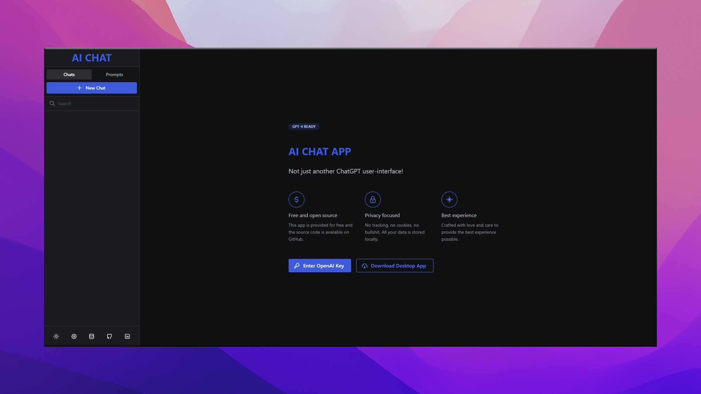

<h1 align="center">AI CHAT APP</h1>
<h2 align="center">Premium quality UI for ChatGPT</h2>

<a href="#">Web App</a>

Recently, there has been a surge of UIs for ChatGPT, making it the new "to-do app" that everyone wants to try their hand at. AI chat sets itself apart with a broader vision - to become the ultimate interface for ChatGPT users.

### ⚡️ Free and open source

This app is provided for free and the source code is available on GitHub.

### 🔒 Privacy focused

No tracking, no cookies, no bullshit. All your data is stored locally.

### ✨ Best experience

Crafted with love and care to provide the best experience possible.

---

## Contribute

This is a React.js application. Clone the project, run `npm i` and `npm start` and you're good to go.